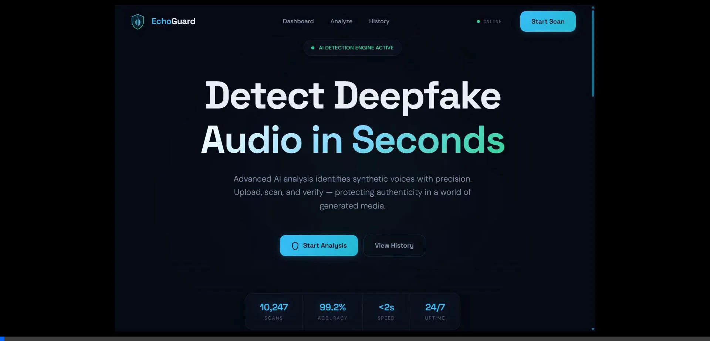
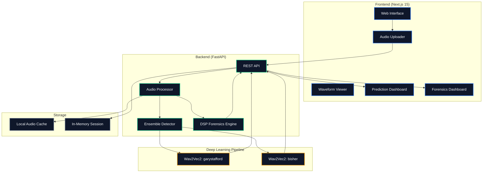

<div align="center">

# EchoGuard: Deepfake Audio Detection

[](https://nextjs.org/)
[](https://fastapi.tiangolo.com/)
[](https://huggingface.co/)

_An end-to-end deep learning platform to identify synthetic speech and voice cloning._

<br />



<br />

</div>

---

## Table of Contents

- [Overview](#overview)
- [Features](#features)
- [System Architecture](#system-architecture)
- [Project Structure](#project-structure)
- [Getting Started](#getting-started)
- [Acknowledgements](#acknowledgements)

---

## Overview

EchoGuard is a powerful deepfake audio detection platform designed to protect against synthetic media. By combining state-of-the-art neural network ensembles with traditional digital signal processing (DSP) forensics, EchoGuard provides a highly accurate, independent, and explainable analysis of any uploaded audio file.

---

## Features

- **Real-Time Analysis**: Upload audio files (WAV, MP3, M4A/AAC) via drag-and-drop for instant evaluation in a beautiful, glassmorphic UI.
- **Interactive Demo Samples**: Instantly test the system using built-in authentic and AI-generated audio samples without needing to find your own files.
- **Timeline Segment Analysis**: Audio is processed in exact 1-second chunks through the DL pipeline to produce a time-mapped visual timeline, pinpointing exactly where deepfake artifacts occur.
- **Forensics Dashboard**: View multi-metric confidence gauges, along with a high-resolution, axes-labeled Mel-Spectrogram for deep visual frequency analysis.

---

## System Architecture

### Dual-Pipeline Design

```text
┌──────────────────────────────────────────────────────┐
│                    Input Audio                        │
└─────────────────────┬────────────────────────────────┘
                      │
          ┌───────────┴───────────┐
          │                       │
          ▼                       ▼
┌─────────────────┐     ┌─────────────────────┐
│   Pipeline 1    │     │     Pipeline 2       │
│  Deep Learning  │     │   Audio Forensics    │
│    Detector     │     │    (DSP Engine)      │
│                 │     │                      │
│   Wav2Vec2      │     │  Signal Processing   │
│   Ensemble      │     │  (librosa)           │
│                 │     │                      │
│  ┌───────────┐  │     │  ┌────────────────┐  │
│  │ Human /   │  │     │  │ Voice          │  │
│  │ AI Prob.  │  │     │  │ Naturalness    │  │
│  └───────────┘  │     │  ├────────────────┤  │
│                 │     │  │ Audio Quality  │  │
│                 │     │  ├────────────────┤  │
│                 │     │  │ Detected       │  │
│                 │     │  │ Characteristics│  │
│                 │     │  └────────────────┘  │
└─────────────────┘     └─────────────────────┘
          │                       │
          └───────────┬───────────┘
                      │
                      ▼
            ┌─────────────────┐
            │    Frontend     │
            │  (Combined UI)  │
            └─────────────────┘
```

### System Overview



### Technology Stack

| Layer        | Framework/Language               | Key Features & Components                                                            |
| :----------- | :------------------------------- | :----------------------------------------------------------------------------------- |
| **Frontend** | Next.js 15, TypeScript, Tailwind | Interactive glassmorphic UI, Audio Uploader, Waveform Canvas, Timeline Visualization |
| **Backend**  | FastAPI, Python 3.11             | High-performance REST architecture, in-memory caching, parallel processing           |

### Deep Learning Pipeline (Deepfake Detection)

- **Architecture Strategy**: Dual-Model Ensemble Strategy utilizing Max-pooling to guarantee the highest detection sensitivity.
- **Timeline Analysis**: Audio is processed in exact 1-second chunks through the ensemble to produce a visual, time-mapped array of deepfake artifacts.

| Designation         | Transformer Architecture                                                                                              | Primary Detection Domain                    |
| :------------------ | :-------------------------------------------------------------------------------------------------------------------- | :------------------------------------------ |
| **Primary Model**   | [garystafford/wav2vec2-deepfake-voice-detector](https://huggingface.co/garystafford/wav2vec2-deepfake-voice-detector) | General Synthetic Audio & AI Voice Clones   |
| **Secondary Model** | [Bisher/wav2vec2_ASV_deepfake_audio_detection](https://huggingface.co/Bisher/wav2vec2_ASV_deepfake_audio_detection)   | High-Fidelity TTS Engines (e.g. ElevenLabs) |

### Audio Forensics Engine (DSP)

The forensic layer is a **completely independent** signal processing engine. It evaluates audio strictly from the raw waveform using `librosa` — it has zero access to the deep learning prediction and will never adjust its scores based on whether the AI classifier thinks the audio is real or fake.

- **Voice Naturalness**: Measures how realistic the voice sounds — evaluates pitch variation (`yin` on voiced frames), pitch range (10th–90th percentile), and pause-to-speech ratios via adaptive RMS energy thresholding (20th percentile baseline).
- **Audio Quality**: Measures recording clarity — computes spectral centroids, spectral bandwidth, RMS consistency, and zero-crossing rate consistency using Gaussian and square-root normalization.
- **Multi-Window Analysis**: Automatically extracts distinct 5-second representative windows to prevent musical intros or silence from corrupting the metrics.
- **Natural Scoring**: Scores span the full 0–100 range based on measured characteristics. No artificial clamping — a clean recording of a human voice can score 85, and so can a high-quality AI-generated voice.

### Data Flow

1. **Upload**: User submits an audio file via the drag-and-drop web interface.
2. **Pre-processing**: FastAPI downsamples the audio to `16kHz mono`, normalizes the amplitude, and renders Mel Spectrograms.
3. **Execution**: The audio is batched into 1-second segments and passed simultaneously through the DL Ensemble and the independent DSP engine.
4. **Synchronization**: The resulting combined payload (Detection Verdict, Timeline Array, Forensic Evidence) is generated and returned.
5. **Visualization**: The UI renders the Prediction, Waveform, Forensics Dashboard, Detected Characteristics, Timeline, and Analysis History with a smooth sequential reveal.

---

## Project Structure

```text
EchoGuard/
├── backend/                    # FastAPI Backend
│   ├── app/                    # Core API, Models, and Services
│   │   ├── services/           # DL Detector and DSP Forensics Engine
│   │   └── routers/            # API Endpoints
│   └── requirements.txt        # Python dependencies
├── frontend/                   # Next.js 15 Frontend
│   ├── src/
│   │   ├── app/                # React App Router pages
│   │   └── components/         # Interactive UI components
│   └── package.json            # Node.js dependencies
├── docs/                       # Demo video and documentation
├── .gitignore                  # Defines ignored files and directories
└── README.md                   # Project documentation
```

---

## Getting Started

### Prerequisites

- Python 3.11+
- Node.js (v20+)

### Installation & Setup

1. **Clone the repository:**

   ```bash
   git clone https://github.com/DhrumilKhatiwala/EchoGuard.git
   cd EchoGuard
   ```

2. **Setup the Backend:**

   ```bash
   cd backend
   pip install -r requirements.txt
   cp .env.example .env
   ```

3. **Setup the Frontend:**

   ```bash
   cd ../frontend
   npm install
   cp .env.example .env.local
   ```

4. **Execute the Application:**
   - Start the backend API: `uvicorn app.main:app --reload --port 8000`
   - Start the frontend UI (in a new terminal): `npm run dev`
   - Access the application at `http://localhost:3000`.

---

## Acknowledgements

- **HuggingFace** for providing the foundational Wav2Vec2 transformer models.
- **Librosa** for the open-source audio and music processing toolkit.
- **FastAPI** and **Next.js** for the incredible developer experience.
