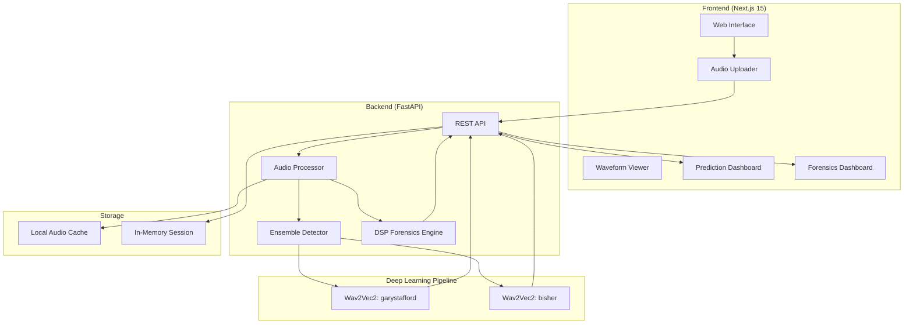

<div align="center">

# EchoGuard: Deepfake Audio Detection

[](https://nextjs.org/)
[](https://fastapi.tiangolo.com/)
[](https://huggingface.co/)

_An end-to-end deep learning platform to identify synthetic voices with high precision._

<br />


<br />

</div>

---

## Table of Contents

- [Overview](#-overview)
- [Features](#-features)
- [System Architecture](#system-architecture)
- [Project Structure](#-project-structure)
- [Getting Started](#-getting-started)
- [Acknowledgements](#-acknowledgements)

---

## Overview

EchoGuard is a powerful deepfake audio detection platform designed to protect against synthetic media. By combining state-of-the-art neural network ensembles with traditional digital signal processing (DSP) forensics, EchoGuard provides a highly accurate, independent, and explainable analysis of any uploaded audio file.

---

## Features

- **Real-Time Analysis**: Upload audio files (WAV, MP3, M4A/AAC) via drag-and-drop for instant evaluation in a beautiful, glassmorphic UI.
- **Timeline Segment Analysis**: Audio is processed in exact 1-second chunks through the ML pipeline to produce a time-mapped visual timeline, pinpointing exactly where deepfake artifacts occur.
- **Forensics Dashboard**: View multi-metric confidence gauges with spectral, temporal, and consistency breakdowns.

---

## System Architecture

### System Overview



### Component Descriptions

#### Frontend
- **Framework**: Next.js 15 with Turbopack (App Router)
- **Language**: TypeScript
- **Styling**: Tailwind CSS with custom glassmorphic cybersecurity design system
- **Key Components**: `AudioUploader`, `WaveformViewer`, `PredictionCard`, `TimelineAnalysis`, `ForensicsDashboard`, `EvidenceSummary`

#### Backend
- **Framework**: FastAPI
- **Language**: Python 3.11
- **API**: RESTful architecture
- **Core Endpoints**: `/api/health`, `/api/analyze`

#### Deep Learning Pipeline (Deepfake Detection)
- **Architecture**: Dual-Model Ensemble
- **Models**:
  1. [garystafford/wav2vec2-deepfake-voice-detector](https://huggingface.co/garystafford/wav2vec2-deepfake-voice-detector) (General Deepfake detection)
  2. [Bisher/wav2vec2_ASV_deepfake_audio_detection](https://huggingface.co/Bisher/wav2vec2_ASV_deepfake_audio_detection) (High-Fidelity TTS detection)
- **Strategy**: Max-pooling. The system takes the highest AI probability between the two models to maximize detection sensitivity.
- **Timeline Analysis**: The audio is processed in 1-second chunks through the ensemble to produce a time-mapped array of predictions, allowing the UI to pinpoint exactly where the deepfake artifacts occur.

#### Audio Forensics Engine (DSP)
- **Independence**: The forensic layer operates completely independently from the DL pipeline. It relies strictly on mathematical signal processing to ensure ground-truth evidence.
- **Metrics**: 
  - **Voice Naturalness**: Computed via pitch standard deviation (`librosa.yin`) on voiced frames and pause ratios (RMS energy thresholding).
  - **Audio Quality**: Computed via spectral centroids, spectral bandwidth, and square-root normalized variance of zero-crossing rates.
- **Multi-Window Analysis**: For files longer than 15 seconds, the engine extracts three discrete 5-second windows (Start, Middle, End) to calculate representative averages, preventing musical intros from corrupting the metrics.

### Data Flow
1. User uploads an audio file via the frontend.
2. The file is sent to the FastAPI `/api/analyze` endpoint.
3. **Preprocessing**: The file is downsampled to 16kHz mono and cached. Mel Spectrograms and Waveforms are generated.
4. **Deepfake Detection**: The audio is split into 1-second batches and passed through the dual `Wav2Vec2` ensemble.
5. **DSP Forensics**: The independent `ForensicsAnalyzer` evaluates the raw waveform to extract voice naturalness, audio quality, and evidence characteristics.
6. The combined payload (Detection Verdict, Timeline Segments, Forensic Evidence) is returned to the frontend.
7. The UI updates the Prediction Dashboard, Timeline Viewer, and Forensics Dashboard simultaneously.

---

## Project Structure

```text
EchoGuard/
├── backend/                    # FastAPI Backend
│   ├── app/                    # Core API, Models, and Services
│   │   ├── services/           # ML Detector and Forensics Engines
│   │   └── routers/            # API Endpoints
│   └── requirements.txt        # Python dependencies
├── frontend/                   # Next.js 15 Frontend
│   ├── src/
│   │   ├── app/                # React App Router pages
│   │   └── components/         # Interactive UI components
│   └── package.json            # Node.js dependencies
├── docs/                       # Architecture diagrams and documentation
├── .gitignore                  # Defines ignored files and directories
└── README.md                   # Project documentation
```

---

## Getting Started

### Prerequisites

- Python 3.11+
- Node.js (v20+)

### Installation & Setup

1. **Clone the repository:**
   ```bash
   git clone https://github.com/username/echoguard.git
   cd echoguard
   ```

2. **Setup the Backend:**
   ```bash
   cd backend
   pip install -r requirements.txt
   cp .env.example .env
   ```

3. **Setup the Frontend:**
   ```bash
   cd ../frontend
   npm install
   cp .env.example .env.local
   ```

4. **Execute the Application:**
   - Start the backend API: `uvicorn app.main:app --reload --port 8000`
   - Start the frontend UI (in a new terminal): `npm run dev`
   - Access the application at `http://localhost:3000`.

---

## Acknowledgements

- **HuggingFace** for providing the foundational Wav2Vec2 transformer models.
- **Librosa** for the open-source audio and music processing toolkit.
- **FastAPI** and **Next.js** for the incredible developer experience.
