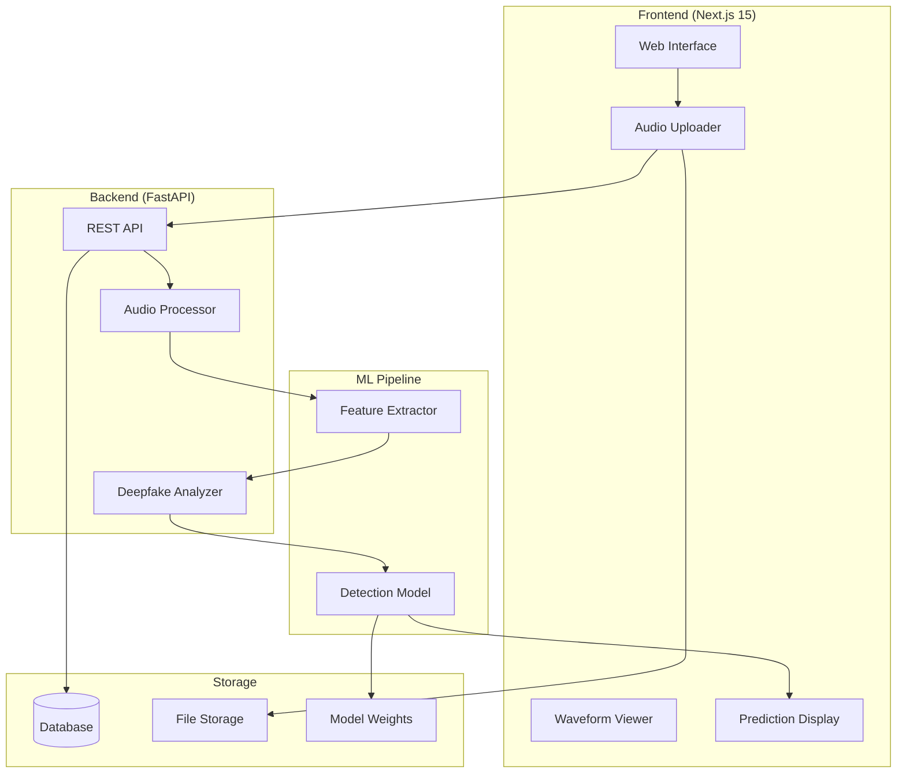

# EchoGuard Architecture

## System Overview

## Component Descriptions

### Frontend
- **Framework**: Next.js 15 with App Router
- **Language**: TypeScript
- **Styling**: Tailwind CSS with custom cybersecurity design system
- **Key Components**: AudioUploader, WaveformViewer, PredictionCard, AnalysisHistory

### Backend
- **Framework**: FastAPI
- **Language**: Python 3.11
- **API**: RESTful with OpenAPI documentation
- **Endpoints**: `/api/health`, `/api/analyze`

### ML Pipeline (Future)
- **Model**: Deep learning-based audio analysis
- **Features**: Spectral analysis, voice consistency, temporal pattern detection
- **Output**: Confidence score with multi-metric breakdown

## Data Flow
1. User uploads audio file via drag-and-drop interface
2. Frontend sends file to backend `/api/analyze` endpoint
3. Backend processes audio and extracts features
4. ML model analyzes features for deepfake indicators
5. Results returned with confidence score and metric breakdown
6. Frontend displays verdict with waveform visualization
