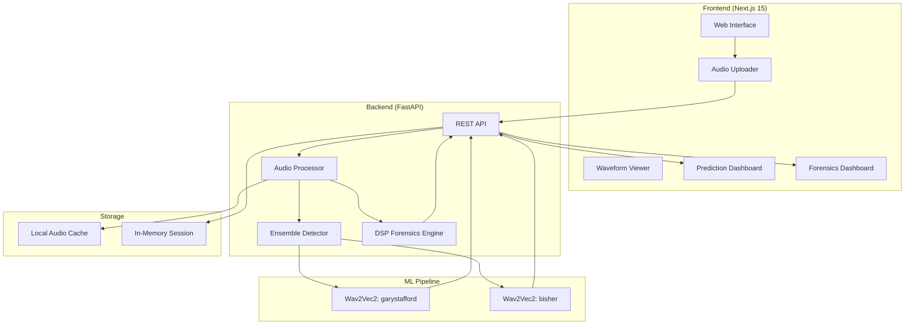

# EchoGuard Architecture

## System Overview

## Component Descriptions

### Frontend
- **Framework**: Next.js 15 with Turbopack (App Router)
- **Language**: TypeScript
- **Styling**: Tailwind CSS with custom glassmorphic cybersecurity design system
- **Key Components**: `AudioUploader`, `WaveformViewer`, `PredictionCard`, `TimelineAnalysis`, `ForensicsDashboard`, `EvidenceSummary`

### Backend
- **Framework**: FastAPI
- **Language**: Python 3.11
- **API**: RESTful architecture
- **Core Endpoints**: `/api/health`, `/api/analyze`

### ML Pipeline (Deepfake Detection)
- **Architecture**: Dual-Model Ensemble
- **Models**:
  1. `garystafford/wav2vec2-deepfake-audio-detection` (General Deepfake detection)
  2. `bisher/wav2vec2-deepfake-audio-detection-elevenlabs` (ElevenLabs specific detection)
- **Strategy**: Max-pooling. The system takes the highest AI probability between the two models to maximize detection sensitivity.
- **Timeline Analysis**: The audio is processed in 1-second chunks through the ensemble to produce a time-mapped array of predictions, allowing the UI to pinpoint exactly where the deepfake artifacts occur.

### Audio Forensics Engine (DSP)
- **Independence**: The forensic layer operates completely independently from the ML pipeline. It relies strictly on mathematical signal processing to ensure ground-truth evidence.
- **Metrics**: 
  - **Voice Naturalness**: Computed via pitch standard deviation (`librosa.yin`) on voiced frames and pause ratios (RMS energy thresholding).
  - **Audio Quality**: Computed via spectral centroids, spectral bandwidth, and square-root normalized variance of zero-crossing rates.
- **Multi-Window Analysis**: For files longer than 15 seconds, the engine extracts three discrete 5-second windows (Start, Middle, End) to calculate representative averages, preventing musical intros from corrupting the metrics.

## Data Flow
1. User uploads an audio file via the frontend.
2. The file is sent to the FastAPI `/api/analyze` endpoint.
3. **Preprocessing**: The file is downsampled to 16kHz mono and cached. Mel Spectrograms and Waveforms are generated.
4. **Deepfake Detection**: The audio is split into 1-second batches and passed through the dual `Wav2Vec2` ensemble.
5. **DSP Forensics**: The independent `ForensicsAnalyzer` evaluates the raw waveform to extract voice naturalness, audio quality, and evidence characteristics.
6. The combined payload (Detection Verdict, Timeline Segments, Forensic Evidence) is returned to the frontend.
7. The UI updates the Prediction Dashboard, Timeline Viewer, and Forensics Dashboard simultaneously.
